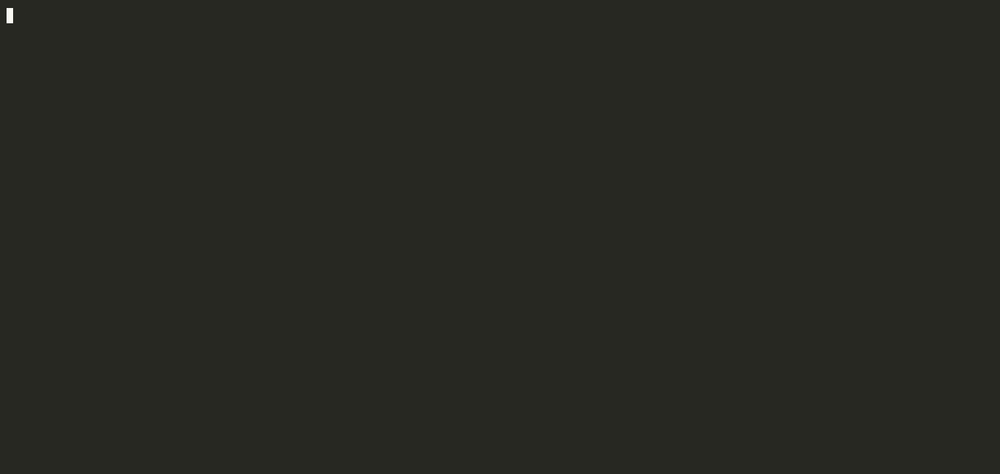
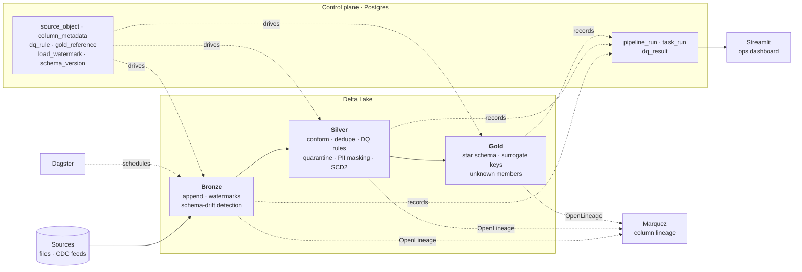
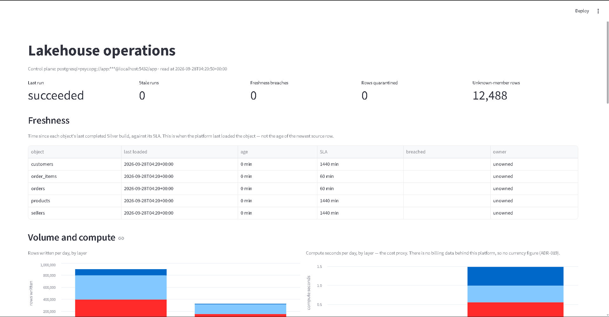

# metadata-driven-lakehouse

> A config-driven lakehouse: onboard a new source with one control-plane row, not a new pipeline — Bronze to a Gold star schema, with quality, PII masking, lineage and an audit trail built in.

[](https://github.com/Pranay777777/metadata-driven-lakehouse/actions/workflows/ci.yml)


[](LICENSE)



*Real output, recorded with [`scripts/record_demo.py`](scripts/record_demo.py): seed 81k rows, run Bronze → Silver → Gold, then let the scanner find and classify the personal data.*

---

## The problem

Most lakehouse pipelines are written one source at a time. Every new table
means another notebook or ADF pipeline with its own copy of the watermark
logic, deduplication, schema handling and error paths — so the tenth source
costs as much as the first, and the copies drift apart. Quality checks,
PII handling and lineage end up bolted on per pipeline, or not at all.

## What this does instead

One engine reads a **metadata control plane** and does the same, correct
thing for every source it describes. Adding a source is configuration:

```sql
INSERT INTO source_object (source_system_id, object_name, load_strategy,
                           primary_key_columns, incremental_column, ...)
VALUES (1, 'returns', 'full', 'return_id', 'updated_at', ...);
```

That row, plus the file landing, is the entire onboarding — no Python. This
is not a slogan: [`test_a_new_source_is_onboarded_by_configuration_alone`](tests/test_pipeline.py)
inserts a sixth source with raw SQL, so nothing in the code knows it exists,
and asserts it flows through Bronze and Silver deduplicated.

## Architecture



Every layer reads its behaviour from the control plane and writes what it
did to the audit trail. **Bronze** lands data exactly as the source sent it,
tracking watermarks and detecting schema drift. **Silver** is where data
becomes trustworthy: conformed names, deduplication, quality rules that can
warn, quarantine or fail, keyed-hash PII masking, and SCD Type 2 history.
**Gold** publishes a star schema whose facts never lose rows — a fact whose
dimension hasn't loaded yet points at an *unknown member* instead of
vanishing from the totals.

| | |
|---|---|
|  |  |
| Column-level lineage, source → Gold, in Marquez | The ops dashboard over the audit trail |

## Quickstart

Runs entirely locally — no cloud account.

```bash
git clone https://github.com/Pranay777777/metadata-driven-lakehouse.git
cd metadata-driven-lakehouse
python -m venv .venv && source .venv/bin/activate   # Windows: .venv/Scripts/activate
pip install -e ".[dev]" && cp .env.example .env
docker compose up -d --wait                          # Postgres + Marquez
```

Then run the whole platform and open the dashboard:

```bash
python -m lakehouse.seed --rows 50000       # synthetic e-commerce data
python -m lakehouse.pipeline --register     # write the catalog into the control plane
python -m lakehouse.pipeline                # Bronze → Silver → Gold
python -m lakehouse.privacy --apply         # classify PII; masking applies from the next run
streamlit run src/lakehouse/dashboard/app.py
```

For column lineage, set `OPENLINEAGE_ENABLED=true` in `.env` and open
http://localhost:3000. No Docker? Set
`DATABASE_URL=sqlite:///control.db` and skip the compose step — everything
except lineage works. `make help` lists every shortcut.

## How it works

**The control plane is typed and constrained.** Eleven SQLAlchemy models
with CHECK constraints reject impossible configuration at insert time — a
CDC source without a key, an incremental load without a watermark column.
DDL for Postgres and Azure SQL is generated from the same models, and
schema changes ship as Alembic migrations.

**Incremental loads are resumable.** Watermarks commit only after a load
succeeds, with a bounded grace window for late-arriving rows. A crash
re-reads rather than skips. `replay` rewinds a watermark deliberately — the
one time it may move backwards — to reprocess a window.

**Schema drift is policy, not surprise.** Every Bronze load fingerprints its
schema. Additive changes evolve the table; breaking ones — a removed or
retyped column — stop the load rather than silently rewriting history.

**Quality has three severities.** Rules come from YAML data contracts
compiled into the control plane. `warn` records, `quarantine` diverts the
failing rows to their own table and keeps the rest, `fail` stops the load.

**PII is classified, then masked by configuration.** A scanner proposes
classifications from column names and sampled values; a human confirms
them. Silver applies a keyed HMAC — deterministic, so masked keys still
join — *after* quality rules run and *before* anything is written,
quarantine included. The most sensitive columns never reach Gold.

**Everything is observable.** Every task writes to the audit trail, every
job emits OpenLineage events, and the dashboard shows freshness against
SLA, volume, rule pass rates, quarantine and privacy posture — all from
single SQL statements over the audit tables.

## Design decisions and tradeoffs

Twenty decisions are recorded in [`docs/adr/`](docs/adr). The ones that
shaped the project most — each with what it cost:

**Arrow + delta-rs by default, Spark as an option** ([ADR-003](docs/adr/0003-arrow-delta-rs-engine.md), [ADR-014](docs/adr/0014-pluggable-engines.md)).
The whole pipeline runs on a laptop in seconds and CI needs no cluster;
Arrow was 16× faster than Spark at a million rows. *Cost:* single-node
memory is the ceiling. The Spark engine behind the same interface is the
answer past it, and a test requires the two to produce identical output.

**The control plane is a database, not YAML** ([ADR-002](docs/adr/0002-metadata-control-plane.md)).
Constraints reject bad config before it runs, and watermarks and audit
rows need transactions. *Cost:* there is a database to operate — mitigated
by SQLite working for everything except lineage.

**SCD2 in Silver, with tombstones** ([ADR-005](docs/adr/0005-scd2-in-silver.md)).
History is available before Gold, and deletes are recorded rather than
lost. *Cost:* history is forever, which is exactly why masking must run
before SCD2 — a value that reaches history unmasked stays there
([ADR-017](docs/adr/0017-pii-masking.md)).

**Unknown members instead of dropped fact rows** ([ADR-006](docs/adr/0006-gold-star-schema.md)).
Totals stay right when a dimension arrives late. *Cost:* some facts point
at key 0 — so the dashboard counts them, rather than letting the gap hide.

**Deterministic masking** ([ADR-017](docs/adr/0017-pii-masking.md)).
Masked keys still join and deduplicate, so masking never tempts anyone to
switch it off. *Cost:* rotating the key is a backfill, and Bronze keeps raw
values by design — its access control is the mitigation, not a transform.

**Declined, deliberately:** Presidio (a spaCy model to regex typed
columns), row-level security (no serving engine to enforce it), and a
dollar cost figure (no billing data behind it). Each ADR says why.

## Results

Measured on a **1 vCPU / 3 GB** Linux container — a deliberately modest
machine; a laptop is faster. Medians of three runs.

| Metric | Value | How measured |
|---|---|---|
| End-to-end pipeline, 1.6M rows / 5 tables | **10.1 s** | [`benchmark_pipeline.py`](scripts/benchmark_pipeline.py) `--rows 1000000` |
| Bronze throughput | 908k rows/s | same run, from the audit trail's own task durations |
| Silver throughput (dedupe, DQ, SCD2) | 432k rows/s | ″ |
| Gold throughput (star schema, surrogate keys) | 502k rows/s | ″ |
| Arrow vs Spark engine, 1M rows | 670k vs 42k rows/s (**16×**) | [`benchmark_engines.py`](scripts/benchmark_engines.py), results compared for equality |
| PII masking | 155k rows/s | 100k customers, 4 masked columns |
| Storage, 1M rows | 47 MB raw → Bronze 47 · Silver 55 · Gold 54 MB | Delta on disk |
| Onboarding a new source | 1 control-plane row + 1 file, **0 lines of code** | [a test](tests/test_pipeline.py) proves it |
| Tests | 499, **96% coverage** | CI: Ubuntu 3.11 / 3.12, Windows 3.12, Postgres 14 |

There is no dollar-per-GB figure: this platform has no billing data, and an
invented rate presented as a measurement would be worse than no number.
The dashboard shows compute-seconds per layer as the proxy; on Databricks
or Synapse the real figure joins billing tables on the same `run_id`.

## Limitations

- **Single node.** The default engine holds a table in memory. Past that,
  switch to the Spark engine — which on a laptop is slower, as above.
- **Masking is the slowest stage.** Keyed hashing runs value by value in
  Python, at about a third of Silver's throughput.
- **Bronze holds raw PII.** By design, so drift detection and replay stay
  honest; a real deployment restricts access to the Bronze prefix.
- **Local disk, not object storage.** Delta supports S3 and ADLS; the
  compose stack does not ship an object store yet.
- **Azure SQL is untested.** DDL is generated for it, but CI runs Postgres
  and SQLite only.
- **No alerting or auth on the dashboard.** It shows a breached SLA;
  nothing pages anyone, and Streamlit serves whoever reaches the port.

## Roadmap

- [ ] Object storage (MinIO locally, ADLS in Azure) via the existing `s3_*` settings
- [ ] Vectorised masking, to close the gap with Silver's throughput
- [ ] Dagster sensors that alert on SLA breaches and quarantine spikes
- [ ] An Azure SQL service job in CI
- [ ] A first real JDBC source, consuming `source_system.secret_name`
- [ ] A Presidio backend for the scanner, once free-text columns arrive

## Project structure

```
src/lakehouse/
  metadata/       control-plane models and enums — the single source of truth
  migrations/     Alembic revisions; migrate.py adopts pre-migration databases
  ingest/         Bronze: full, incremental and CDC loads, schema drift
  transform/      Silver (conform, dedupe, SCD2) and Gold (star schema)
  quality/        DQ engine and quarantine
  contracts/      YAML data contracts compiled into rules
  engines/        Arrow (default) and Spark, behind one interface
  privacy.py      PII scanner and masking
  credentials.py  secrets resolved by name — env or Azure Key Vault
  audit.py        run tracking and every query the dashboard shows
  dashboard/      Streamlit ops dashboard
  orchestration/  Dagster assets generated from the catalog
  lineage.py      OpenLineage emission
tests/            499 tests; test_integration_postgres.py needs a real Postgres
docs/adr/         twenty architecture decision records
scripts/          benchmarks, demo recorder, DDL generator
```

## Development

```bash
make help                        # every target
make lint typecheck test         # the gates
make test-integration            # against the compose Postgres, in throwaway databases
python -m lakehouse.migrate      # bring a control plane to the latest schema
```

Gates: `ruff`, `mypy --strict`, `pytest` (70% floor; 96% actual), `gitleaks`
over every ref, and `pip-audit`. CI runs them on Ubuntu (Python 3.11 and
3.12) and Windows (3.12), plus an integration job against Postgres 14.

## License

MIT — see [LICENSE](LICENSE).
