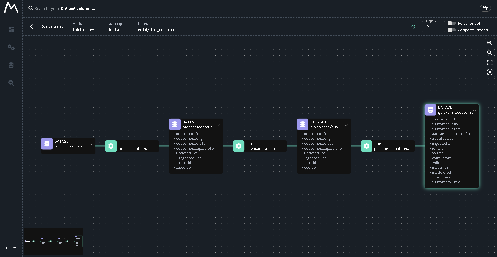

# A lakehouse you configure instead of code: 1.6M rows, Bronze to Gold, on a laptop

## The problem

Most lakehouse pipelines are written one source at a time. Every new table
gets its own notebook, with its own copy of the watermark logic,
deduplication and error handling. The tenth source costs as much as the
first, and the copies drift apart. Quality checks, PII handling and lineage
get bolted on per pipeline, or not at all. I wanted the opposite: one engine
that reads configuration and does the same correct thing for every source.

## Metadata drives everything

The configuration lives in a database, not in YAML
([ADR-002](adr/0002-metadata-control-plane.md)). Eleven typed models
describe sources, columns, quality rules, Gold references, watermarks and
schema versions. CHECK constraints reject impossible setups at insert time:
a CDC source without a key, or an incremental load without a watermark
column.

Each source row says how it loads: full, incremental by watermark, or CDC.
Adding a source is one row plus the landed file. I don't just claim that.
[A test](../tests/test_pipeline.py) inserts a sixth source with raw SQL, so
no code knows it exists, and asserts it flows through Bronze and Silver
deduplicated.

## The failures real pipelines hit

The happy path is easy. The tests I care about are the failures.

**Crashes and re-runs.** A watermark only moves after the write succeeds.
If a load fails, the next run re-reads instead of skipping rows. A test
makes the source explode mid-load and checks the watermark did not move.
Another runs a pipeline where one table breaks, heals it, resumes, and
checks that nothing is duplicated.

**Late data.** Each source can read from the watermark minus a grace
window, so late rows inside it still land. The watermark never moves
backwards ([ADR-004](adr/0004-late-arriving-data.md)).

**Schema drift.** Every Bronze load fingerprints its schema. A new column
evolves the table automatically. A removed or retyped column stops the load
instead of quietly rewriting history
([ADR-007](adr/0007-schema-drift.md)).

**Quality.** Rules come from YAML data contracts with three severities:
`warn` records, `quarantine` moves the failing rows to their own table and
keeps the rest, `fail` stops the load
([ADR-008](adr/0008-data-contracts.md),
[ADR-009](adr/0009-data-quality-engine.md)).

## Measured, including what I declined

On a 1 vCPU / 3 GB Linux container, the whole pipeline moves 1.6 million
rows across five tables, Bronze to Gold, in 10.1 seconds (median of three).
Silver, which dedupes, checks and keeps history, runs at 432k rows a second.

The default engine is Arrow with delta-rs, not Spark
([ADR-003](adr/0003-arrow-delta-rs-engine.md)). On 2 million rows Arrow was
8.7× faster in a Linux container and 4.0× faster on a Windows laptop
([ADR-014](adr/0014-pluggable-engines.md)). That is not "Spark is slow".
Spark pays a mostly fixed cost: JVM startup and moving data to executors.
At laptop scale that cost dominates. Past what fits in memory, Spark is the
answer, so it sits behind the same interface and a test requires identical
output from both.

I declined two things the plan asked for. Partitioning: below roughly a
gigabyte a day per table it just multiplies small files
([ADR-015](adr/0015-table-maintenance.md)). Presidio: it pulls in spaCy and
a language model to find entities in free text, and every column here is a
typed scalar ([ADR-017](adr/0017-pii-masking.md)).

## Seeing it

Every job emits OpenLineage events, so Marquez shows column-level lineage
from source to Gold ([ADR-012](adr/0012-openlineage.md)). A Streamlit
dashboard reads the audit trail: freshness against SLA, volume, rule pass
rates and quarantine ([ADR-019](adr/0019-ops-dashboard.md)). Both run
locally, with no cloud account.

## What I'd do differently

I would run the benchmarks on one fixed machine from the start. My numbers
come from a container and a laptop, and the Arrow-vs-Spark gap halves
between them.
I would add object storage early, since local disk hides real I/O costs.
And I would vectorise PII masking: at 155k rows a second, it is the slowest
stage.
